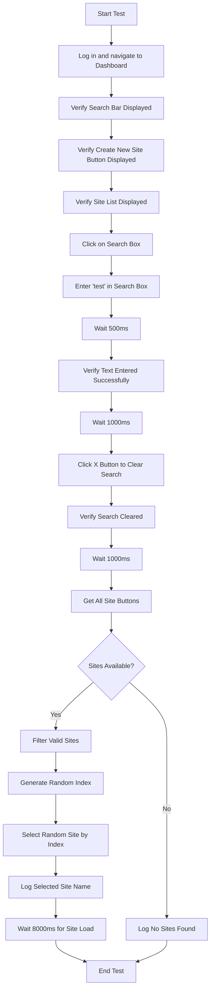

# Random Site Selection - Design Document

## Feature Overview

Enhance the SiteSelectionTest suite with two specific test scenarios:
- Search box interaction with clear functionality
- Random site selection from available sites

## Objective

Update TC_SS_001 test case to validate the complete search workflow including entering text and clearing the search box using the X button (clear icon). Additionally, implement random site selection logic to select any available site from the site list.

## Scope

### Test Case: TC_SS_001 - Verify Select Site Screen UI Elements

This test will be updated to include additional search interaction validation while maintaining existing UI element verification.

#### Current Behavior
- Logs in and navigates to the Sites screen
- Verifies search bar is displayed
- Verifies Create New Site button is displayed
- Verifies site list is displayed

#### Enhanced Behavior
After verifying the existing UI elements, the test will additionally:
1. Click on the search box and enter text
2. Verify text entry is successful
3. Clear the search box using the X button (xmark.circle.fill)
4. Verify the search box is cleared
5. Select a random site from the available sites
6. Verify the site selection is successful

### Random Site Selection Feature

#### Purpose
Provide the ability to randomly select any site from the available site list to validate site loading and navigation with different sites during test execution.

## Test Workflow

### TC_SS_001 Enhanced Flow

## Search Clear Functionality

### Search Interaction Sequence

| Step | Action | Element | Expected Outcome |
|------|--------|---------|------------------|
| 1 | Click search box | Search field with value 'Search sites...' | Search box becomes active and ready for input |
| 2 | Enter text | Type "test" into search box | Text "test" appears in search field |
| 3 | Wait | Pause for 500ms | Allow UI to update |
| 4 | Verify | Check text entry | Console log shows "✅ Entered 'test' in search box" |
| 5 | Wait | Pause for 1000ms | Observe search results |
| 6 | Click clear | Click X button (xmark.circle.fill) | Search field is cleared |
| 7 | Verify | Check search cleared | Console log shows "✅ Search box cleared" |
| 8 | Wait | Pause for 1000ms | All sites reappear in list |

### Element Identification

**Search Box:**
- Locator Strategy: iOS NSPredicate String
- Predicate: `value == 'Search sites...'`
- Element Type: TextField

**Clear Button:**
- Locator Strategy: Accessibility ID
- Accessibility ID: `xmark.circle.fill`
- Element Type: Button
- Visibility: Appears only after text is entered in search box

## Random Site Selection Logic

### Site Filtering Rules

The system must identify valid site buttons from all available buttons on the screen by excluding system buttons and UI elements.

### Exclusion Criteria

Buttons to be excluded from site selection:
- "Emoji" - System keyboard button
- "dictation" - System keyboard button
- "Create New Site" - Action button, not a site
- "Cancel" - Navigation button
- "xmark.circle.fill" - Search clear button

### Site Identification Pattern

A valid site button must have:
- A non-null name attribute
- A name containing a comma (sites are formatted as "Site Name, Address")
- A name not matching any exclusion criteria

### Random Selection Process

| Step | Activity | Details |
|------|----------|---------|
| 1 | Query all buttons | Find all elements with type 'XCUIElementTypeButton' |
| 2 | Initialize site list | Create empty list to store valid sites |
| 3 | Iterate through buttons | Loop through each button found |
| 4 | Extract name attribute | Get the 'name' attribute from each button |
| 5 | Apply filters | Check name is not null, not in exclusion list, and contains comma |
| 6 | Add to site list | If all criteria pass, add button to sites list |
| 7 | Count sites | Log total number of sites found |
| 8 | Check availability | Verify sites list size is greater than 0 |
| 9 | Generate random index | Use Random().nextInt(sites.size()) to get index |
| 10 | Get site details | Extract site name from selected button |
| 11 | Perform click | Click the randomly selected site button |
| 12 | Log selection | Output selected site name and index position |
| 13 | Wait for load | Pause 8000ms for site to fully load |

### Random Index Generation

The random index is generated using Java's Random class:
- Create new Random instance
- Call nextInt with site list size as upper bound
- Returns value between 0 (inclusive) and size (exclusive)
- Ensures valid array index for site selection

## Wait Times and Timing

| Action | Wait Duration | Rationale |
|--------|---------------|-----------|
| After entering search text | 500ms | Allow search field to register input |
| Before clearing search | 1000ms | Observe filtered results |
| After clearing search | 1000ms | Allow site list to repopulate |
| After site selection | 8000ms | Wait for site data to load completely |

## Logging and Verification

### Console Output Format

The test produces clear, emoji-prefixed console messages for easy tracking:

**Search Operations:**
- "✅ Entered 'test' in search box" - Confirms text entry
- "✅ Search box cleared" - Confirms clear action

**Site Selection:**
- "📋 Found X sites" - Reports total sites available
- "✅ Selected site: [Site Name] (Index: Y of X)" - Reports selected site details
- "❌ No sites found" - Reports if no sites are available

### Expected Results

| Scenario | Expected Result |
|----------|----------------|
| Sites available | Random site selected, name logged, navigation occurs |
| No sites available | "No sites found" message logged, test continues |
| Search text entered | Text visible in search box, console confirmation |
| Search cleared | Search box empty, full site list restored |

## Integration Points

### Page Object Model

The implementation utilizes the existing SiteSelectionPage methods:
- searchSite(String) - For entering search text
- clearSearch() - For clicking clear button (via xmark.circle.fill)
- getAllSites() - Returns filtered list of valid site buttons
- selectSiteByIndex(int) - Clicks site at specified index

### Test Base Class

The test extends BaseTest which provides:
- loginAndGoToDashboard() - Authentication and navigation
- logStep(String) - Console logging utility
- logStepWithScreenshot(String) - Screenshot capture with logging
- assertTrue(), assertEquals() - Assertion methods
- Thread.sleep(long) - Wait functionality

## Expected Test Behavior

### Success Path

1. Test logs in successfully
2. Navigates to Sites screen
3. All UI elements are verified and present
4. Search box accepts "test" input
5. Clear button appears and clears search successfully
6. Multiple sites are found in the list
7. Random site is selected from available options
8. Site loads within 8 seconds
9. Test passes with all assertions successful

### Edge Cases

| Edge Case | Handling |
|-----------|----------|
| Only one site available | Random selection still works (index 0) |
| No sites available | Log "No sites found" but don't fail test |
| Clear button not appearing | Fallback to alternative clear method |
| Site load timeout | Test continues after 8 second wait |

## Implementation Notes

### Thread Safety
All waits use Thread.sleep() which is acceptable in test automation context for explicit waits between UI actions.

### Code Location
- Test Class: SiteSelectionTest.java
- Test Method: TC_SS_001_verifySelectSiteScreenUIElements()
- Package: com.egalvanic.tests
- Module: Site Selection Test Suite

### Dependencies
- Appium WebDriver for element interaction
- iOS XCUITest framework for element identification
- TestNG for test execution and assertions
- ExtentReports for test reporting

## Acceptance Criteria

The updated TC_SS_001 test must:
1. Execute all existing UI verification steps successfully
2. Enter text into search box without errors
3. Display clear button after text entry
4. Clear search box when X button is clicked
5. Identify at least one valid site from button list
6. Generate valid random index within site list bounds
7. Select and click on randomly chosen site
8. Log all actions with appropriate console messages
9. Complete within reasonable time (under 30 seconds total)
10. Pass all assertions without failures

## Non-Functional Considerations

### Performance
- Search operations should respond within 1 second
- Site list filtering should complete in under 500ms
- Random selection calculation is instantaneous

### Reliability
- Handle dynamic element timing with explicit waits
- Gracefully handle scenarios with 0 or 1 site
- Fallback mechanisms for element identification

### Maintainability
- Clear separation of search and selection logic
- Reusable methods from Page Object Model
- Descriptive logging for troubleshooting

## Test Data Requirements

**Search Text:**
- Value: "test"
- Purpose: Generic search term to filter site list
- Expected: Filters sites containing "test" in name or address

**Site List:**
- Minimum: 0 sites (edge case)
- Typical: 5-20 sites
- Maximum: No defined limit

**Wait Times:**
- Configurable via Thread.sleep() parameters
- Can be adjusted based on environment performance
|------|--------|---------|------------------|
| 1 | Click search box | Search field with value 'Search sites...' | Search box becomes active and ready for input |
| 2 | Enter text | Type "test" into search box | Text "test" appears in search field |
| 3 | Wait | Pause for 500ms | Allow UI to update |
| 4 | Verify | Check text entry | Console log shows "✅ Entered 'test' in search box" |
| 5 | Wait | Pause for 1000ms | Observe search results |
| 6 | Click clear | Click X button (xmark.circle.fill) | Search field is cleared |
| 7 | Verify | Check search cleared | Console log shows "✅ Search box cleared" |
| 8 | Wait | Pause for 1000ms | All sites reappear in list |

### Element Identification

**Search Box:**
- Locator Strategy: iOS NSPredicate String
- Predicate: `value == 'Search sites...'`
- Element Type: TextField

**Clear Button:**
- Locator Strategy: Accessibility ID
- Accessibility ID: `xmark.circle.fill`
- Element Type: Button
- Visibility: Appears only after text is entered in search box

## Random Site Selection Logic

### Site Filtering Rules

The system must identify valid site buttons from all available buttons on the screen by excluding system buttons and UI elements.

### Exclusion Criteria

Buttons to be excluded from site selection:
- "Emoji" - System keyboard button
- "dictation" - System keyboard button
- "Create New Site" - Action button, not a site
- "Cancel" - Navigation button
- "xmark.circle.fill" - Search clear button

### Site Identification Pattern

A valid site button must have:
- A non-null name attribute
- A name containing a comma (sites are formatted as "Site Name, Address")
- A name not matching any exclusion criteria

### Random Selection Process

| Step | Activity | Details |
|------|----------|---------|
| 1 | Query all buttons | Find all elements with type 'XCUIElementTypeButton' |
| 2 | Initialize site list | Create empty list to store valid sites |
| 3 | Iterate through buttons | Loop through each button found |
| 4 | Extract name attribute | Get the 'name' attribute from each button |
| 5 | Apply filters | Check name is not null, not in exclusion list, and contains comma |
| 6 | Add to site list | If all criteria pass, add button to sites list |
| 7 | Count sites | Log total number of sites found |
| 8 | Check availability | Verify sites list size is greater than 0 |
| 9 | Generate random index | Use Random().nextInt(sites.size()) to get index |
| 10 | Get site details | Extract site name from selected button |
| 11 | Perform click | Click the randomly selected site button |
| 12 | Log selection | Output selected site name and index position |
| 13 | Wait for load | Pause 8000ms for site to fully load |

### Random Index Generation

The random index is generated using Java's Random class:
- Create new Random instance
- Call nextInt with site list size as upper bound
- Returns value between 0 (inclusive) and size (exclusive)
- Ensures valid array index for site selection

## Wait Times and Timing

| Action | Wait Duration | Rationale |
|--------|---------------|-----------|
| After entering search text | 500ms | Allow search field to register input |
| Before clearing search | 1000ms | Observe filtered results |
| After clearing search | 1000ms | Allow site list to repopulate |
| After site selection | 8000ms | Wait for site data to load completely |

## Logging and Verification

### Console Output Format

The test produces clear, emoji-prefixed console messages for easy tracking:

**Search Operations:**
- "✅ Entered 'test' in search box" - Confirms text entry
- "✅ Search box cleared" - Confirms clear action

**Site Selection:**
- "📋 Found X sites" - Reports total sites available
- "✅ Selected site: [Site Name] (Index: Y of X)" - Reports selected site details
- "❌ No sites found" - Reports if no sites are available

### Expected Results

| Scenario | Expected Result |
|----------|----------------|
| Sites available | Random site selected, name logged, navigation occurs |
| No sites available | "No sites found" message logged, test continues |
| Search text entered | Text visible in search box, console confirmation |
| Search cleared | Search box empty, full site list restored |

## Integration Points

### Page Object Model

The implementation utilizes the existing SiteSelectionPage methods:
- searchSite(String) - For entering search text
- clearSearch() - For clicking clear button (via xmark.circle.fill)
- getAllSites() - Returns filtered list of valid site buttons
- selectSiteByIndex(int) - Clicks site at specified index

### Test Base Class

The test extends BaseTest which provides:
- loginAndGoToDashboard() - Authentication and navigation
- logStep(String) - Console logging utility
- logStepWithScreenshot(String) - Screenshot capture with logging
- assertTrue(), assertEquals() - Assertion methods
- Thread.sleep(long) - Wait functionality

## Expected Test Behavior

### Success Path

1. Test logs in successfully
2. Navigates to Sites screen
3. All UI elements are verified and present
4. Search box accepts "test" input
5. Clear button appears and clears search successfully
6. Multiple sites are found in the list
7. Random site is selected from available options
8. Site loads within 8 seconds
9. Test passes with all assertions successful

### Edge Cases

| Edge Case | Handling |
|-----------|----------|
| Only one site available | Random selection still works (index 0) |
| No sites available | Log "No sites found" but don't fail test |
| Clear button not appearing | Fallback to alternative clear method |
| Site load timeout | Test continues after 8 second wait |

## Implementation Notes

### Thread Safety
All waits use Thread.sleep() which is acceptable in test automation context for explicit waits between UI actions.

### Code Location
- Test Class: SiteSelectionTest.java
- Test Method: TC_SS_001_verifySelectSiteScreenUIElements()
- Package: com.egalvanic.tests
- Module: Site Selection Test Suite

### Dependencies
- Appium WebDriver for element interaction
- iOS XCUITest framework for element identification
- TestNG for test execution and assertions
- ExtentReports for test reporting

## Acceptance Criteria

The updated TC_SS_001 test must:
1. Execute all existing UI verification steps successfully
2. Enter text into search box without errors
3. Display clear button after text entry
4. Clear search box when X button is clicked
5. Identify at least one valid site from button list
6. Generate valid random index within site list bounds
7. Select and click on randomly chosen site
8. Log all actions with appropriate console messages
9. Complete within reasonable time (under 30 seconds total)
10. Pass all assertions without failures

## Non-Functional Considerations

### Performance
- Search operations should respond within 1 second
- Site list filtering should complete in under 500ms
- Random selection calculation is instantaneous

### Reliability
- Handle dynamic element timing with explicit waits
- Gracefully handle scenarios with 0 or 1 site
- Fallback mechanisms for element identification

### Maintainability
- Clear separation of search and selection logic
- Reusable methods from Page Object Model
- Descriptive logging for troubleshooting

## Test Data Requirements

**Search Text:**
- Value: "test"
- Purpose: Generic search term to filter site list
- Expected: Filters sites containing "test" in name or address

**Site List:**
- Minimum: 0 sites (edge case)
- Typical: 5-20 sites
- Maximum: No defined limit

**Wait Times:**
- Configurable via Thread.sleep() parameters
- Can be adjusted based on environment performance
|------|--------|---------|------------------|
| 1 | Click search box | Search field with value 'Search sites...' | Search box becomes active and ready for input |
| 2 | Enter text | Type "test" into search box | Text "test" appears in search field |
| 3 | Wait | Pause for 500ms | Allow UI to update |
| 4 | Verify | Check text entry | Console log shows "✅ Entered 'test' in search box" |
| 5 | Wait | Pause for 1000ms | Observe search results |
| 6 | Click clear | Click X button (xmark.circle.fill) | Search field is cleared |
| 7 | Verify | Check search cleared | Console log shows "✅ Search box cleared" |
| 8 | Wait | Pause for 1000ms | All sites reappear in list |

### Element Identification

**Search Box:**
- Locator Strategy: iOS NSPredicate String
- Predicate: `value == 'Search sites...'`
- Element Type: TextField

**Clear Button:**
- Locator Strategy: Accessibility ID
- Accessibility ID: `xmark.circle.fill`
- Element Type: Button
- Visibility: Appears only after text is entered in search box

## Random Site Selection Logic

### Site Filtering Rules

The system must identify valid site buttons from all available buttons on the screen by excluding system buttons and UI elements.

### Exclusion Criteria

Buttons to be excluded from site selection:
- "Emoji" - System keyboard button
- "dictation" - System keyboard button
- "Create New Site" - Action button, not a site
- "Cancel" - Navigation button
- "xmark.circle.fill" - Search clear button

### Site Identification Pattern

A valid site button must have:
- A non-null name attribute
- A name containing a comma (sites are formatted as "Site Name, Address")
- A name not matching any exclusion criteria

### Random Selection Process

| Step | Activity | Details |
|------|----------|---------|
| 1 | Query all buttons | Find all elements with type 'XCUIElementTypeButton' |
| 2 | Initialize site list | Create empty list to store valid sites |
| 3 | Iterate through buttons | Loop through each button found |
| 4 | Extract name attribute | Get the 'name' attribute from each button |
| 5 | Apply filters | Check name is not null, not in exclusion list, and contains comma |
| 6 | Add to site list | If all criteria pass, add button to sites list |
| 7 | Count sites | Log total number of sites found |
| 8 | Check availability | Verify sites list size is greater than 0 |
| 9 | Generate random index | Use Random().nextInt(sites.size()) to get index |
| 10 | Get site details | Extract site name from selected button |
| 11 | Perform click | Click the randomly selected site button |
| 12 | Log selection | Output selected site name and index position |
| 13 | Wait for load | Pause 8000ms for site to fully load |

### Random Index Generation

The random index is generated using Java's Random class:
- Create new Random instance
- Call nextInt with site list size as upper bound
- Returns value between 0 (inclusive) and size (exclusive)
- Ensures valid array index for site selection

## Wait Times and Timing

| Action | Wait Duration | Rationale |
|--------|---------------|-----------|
| After entering search text | 500ms | Allow search field to register input |
| Before clearing search | 1000ms | Observe filtered results |
| After clearing search | 1000ms | Allow site list to repopulate |
| After site selection | 8000ms | Wait for site data to load completely |

## Logging and Verification

### Console Output Format

The test produces clear, emoji-prefixed console messages for easy tracking:

**Search Operations:**
- "✅ Entered 'test' in search box" - Confirms text entry
- "✅ Search box cleared" - Confirms clear action

**Site Selection:**
- "📋 Found X sites" - Reports total sites available
- "✅ Selected site: [Site Name] (Index: Y of X)" - Reports selected site details
- "❌ No sites found" - Reports if no sites are available

### Expected Results

| Scenario | Expected Result |
|----------|----------------|
| Sites available | Random site selected, name logged, navigation occurs |
| No sites available | "No sites found" message logged, test continues |
| Search text entered | Text visible in search box, console confirmation |
| Search cleared | Search box empty, full site list restored |

## Integration Points

### Page Object Model

The implementation utilizes the existing SiteSelectionPage methods:
- searchSite(String) - For entering search text
- clearSearch() - For clicking clear button (via xmark.circle.fill)
- getAllSites() - Returns filtered list of valid site buttons
- selectSiteByIndex(int) - Clicks site at specified index

### Test Base Class

The test extends BaseTest which provides:
- loginAndGoToDashboard() - Authentication and navigation
- logStep(String) - Console logging utility
- logStepWithScreenshot(String) - Screenshot capture with logging
- assertTrue(), assertEquals() - Assertion methods
- Thread.sleep(long) - Wait functionality

## Expected Test Behavior

### Success Path

1. Test logs in successfully
2. Navigates to Sites screen
3. All UI elements are verified and present
4. Search box accepts "test" input
5. Clear button appears and clears search successfully
6. Multiple sites are found in the list
7. Random site is selected from available options
8. Site loads within 8 seconds
9. Test passes with all assertions successful

### Edge Cases

| Edge Case | Handling |
|-----------|----------|
| Only one site available | Random selection still works (index 0) |
| No sites available | Log "No sites found" but don't fail test |
| Clear button not appearing | Fallback to alternative clear method |
| Site load timeout | Test continues after 8 second wait |

## Implementation Notes

### Thread Safety
All waits use Thread.sleep() which is acceptable in test automation context for explicit waits between UI actions.

### Code Location
- Test Class: SiteSelectionTest.java
- Test Method: TC_SS_001_verifySelectSiteScreenUIElements()
- Package: com.egalvanic.tests
- Module: Site Selection Test Suite

### Dependencies
- Appium WebDriver for element interaction
- iOS XCUITest framework for element identification
- TestNG for test execution and assertions
- ExtentReports for test reporting

## Acceptance Criteria

The updated TC_SS_001 test must:
1. Execute all existing UI verification steps successfully
2. Enter text into search box without errors
3. Display clear button after text entry
4. Clear search box when X button is clicked
5. Identify at least one valid site from button list
6. Generate valid random index within site list bounds
7. Select and click on randomly chosen site
8. Log all actions with appropriate console messages
9. Complete within reasonable time (under 30 seconds total)
10. Pass all assertions without failures

## Non-Functional Considerations

### Performance
- Search operations should respond within 1 second
- Site list filtering should complete in under 500ms
- Random selection calculation is instantaneous

### Reliability
- Handle dynamic element timing with explicit waits
- Gracefully handle scenarios with 0 or 1 site
- Fallback mechanisms for element identification

### Maintainability
- Clear separation of search and selection logic
- Reusable methods from Page Object Model
- Descriptive logging for troubleshooting

## Test Data Requirements

**Search Text:**
- Value: "test"
- Purpose: Generic search term to filter site list
- Expected: Filters sites containing "test" in name or address

**Site List:**
- Minimum: 0 sites (edge case)
- Typical: 5-20 sites
- Maximum: No defined limit

**Wait Times:**
- Configurable via Thread.sleep() parameters
- Can be adjusted based on environment performance
